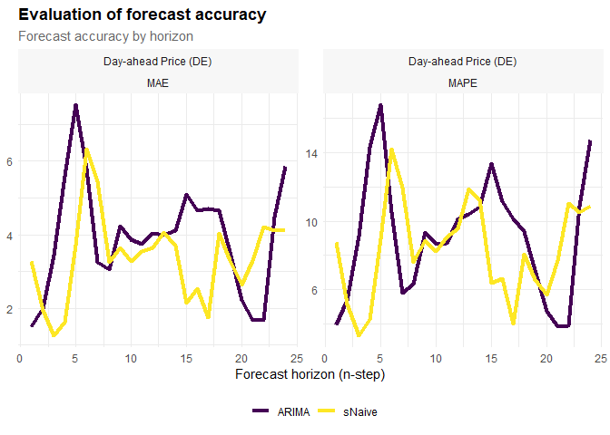

<!-- README.md is generated from README.Rmd. Please edit that file -->

# tscv

<!-- badges: start -->

<!-- badges: end -->

The package tscv provides a collection of functions and tools for time
series analysis and forecasting as well as time series cross-validation.
This is mainly a selection of functions that I find useful for research
in the area of time series forecasting.

## Installation

You can install the development version from
[GitHub](https://github.com/) with:

``` r
# install.packages("devtools")
devtools::install_github("ahaeusser/tscv")
```

## Example

``` r
# Load relevant packages
library(tscv)
library(tidyverse)
#> Warning: package 'ggplot2' was built under R version 3.6.3
#> Warning: package 'tidyr' was built under R version 3.6.3
#> Warning: package 'dplyr' was built under R version 3.6.3
#> Warning: package 'forcats' was built under R version 3.6.3
library(tsibble)
#> Warning: package 'tsibble' was built under R version 3.6.3
library(fable)
#> Warning: package 'fable' was built under R version 3.6.3
library(feasts)
#> Warning: package 'feasts' was built under R version 3.6.3
Sys.setlocale("LC_TIME", "C")
#> [1] "C"
```

The dataset `elec_price` is a hourly ‘tsibble’ with day-ahead
electricity spot prices from the ENTSO-E Transparency Platform. The
dataset contains time series data from 2019-01-01 00:00:00 to 2019-12-31
23:00:00 for five bidding zones in europe. We can use the function
`clean_data` to prepare the dataset for further usage. The function
checks whether the input data are a valid tsibble or not (regular spaced
in time and ordered). Furthermore, implicit missing values are turned
into explicit missing values (existing missing values are left
untouched). If the data are provided in wide format, they are gathered
into long format. For convenience, the index variable is renamed to
`date_time`, the key variable is renamed to `variable` and the
measurement variable is renamed to `value`.

``` r
data <- elec_price %>%
  clean_data()

data
#> # A tsibble: 43,800 x 3 [1h] <UTC>
#> # Key:       variable [5]
#>    date_time           variable              value
#>    <dttm>              <chr>                 <dbl>
#>  1 2019-01-01 00:00:00 Day-ahead Price (DE)  10.1 
#>  2 2019-01-01 01:00:00 Day-ahead Price (DE)  -4.08
#>  3 2019-01-01 02:00:00 Day-ahead Price (DE)  -9.91
#>  4 2019-01-01 03:00:00 Day-ahead Price (DE)  -7.41
#>  5 2019-01-01 04:00:00 Day-ahead Price (DE) -12.6 
#>  6 2019-01-01 05:00:00 Day-ahead Price (DE) -17.2 
#>  7 2019-01-01 06:00:00 Day-ahead Price (DE) -15.1 
#>  8 2019-01-01 07:00:00 Day-ahead Price (DE)  -4.93
#>  9 2019-01-01 08:00:00 Day-ahead Price (DE)  -6.33
#> 10 2019-01-01 09:00:00 Day-ahead Price (DE)  -4.93
#> # ... with 43,790 more rows
 
sub_data <- data %>%
  filter(variable == "Day-ahead Price (DE)")

sub_data %>% plot_ts()
```


``` r
sub_data %>% plot_season()
```


``` r
sub_data %>% plot_corr()
```


To prepare the dataset for time series cross-validation, we can use the
function `split_data`. This function splits the data into training and
testing (i.e. partitioning into time slices) for time series
cross-validation. The user can choose between `stretch` and `slide`. The
first is an expanding window approach, while the latter is a fixed
window approach. The user can define the window sizes for training and
testing via `n_init` and `n_ahead`, as well as the step size for
increments via `n_step`.

``` r

mode <- "slide"
n_init <- 2400
n_step <- 24
n_ahead <- 24

data <- data %>%
  split_data(
    mode = mode,
    n_init = n_init,
    n_step = n_step,
    n_ahead = n_ahead)

data <- data %>% 
  filter(slice %in% c(1:5))
```

``` r
models <- data %>%
  filter(sample == "train") %>%
  model(
    sNaive = SNAIVE(value),
    STLF = decomposition_model(STL(value ~ trend(window = 7), robust = TRUE), NAIVE(season_adjust)))

fcsts <- models %>%
  forecast_model(n_ahead = n_ahead)
```

``` r
data <- bind_data(
  data = data,
  fcsts = fcsts)

data
#> # A tsibble: 61,800 x 8 [1h] <UTC>
#> # Key:       variable, slice, model, type [75]
#>    date_time           variable           sample slice horizon type  model value
#>    <dttm>              <chr>              <chr>  <int>   <int> <chr> <chr> <dbl>
#>  1 2019-04-11 00:00:00 Day-ahead Price (~ test       1       1 fcst  sNai~  36.5
#>  2 2019-04-11 01:00:00 Day-ahead Price (~ test       1       2 fcst  sNai~  35.8
#>  3 2019-04-11 02:00:00 Day-ahead Price (~ test       1       3 fcst  sNai~  36.6
#>  4 2019-04-11 03:00:00 Day-ahead Price (~ test       1       4 fcst  sNai~  38.6
#>  5 2019-04-11 04:00:00 Day-ahead Price (~ test       1       5 fcst  sNai~  47.0
#>  6 2019-04-11 05:00:00 Day-ahead Price (~ test       1       6 fcst  sNai~  54.4
#>  7 2019-04-11 06:00:00 Day-ahead Price (~ test       1       7 fcst  sNai~  58.0
#>  8 2019-04-11 07:00:00 Day-ahead Price (~ test       1       8 fcst  sNai~  50.6
#>  9 2019-04-11 08:00:00 Day-ahead Price (~ test       1       9 fcst  sNai~  46.2
#> 10 2019-04-11 09:00:00 Day-ahead Price (~ test       1      10 fcst  sNai~  44.4
#> # ... with 61,790 more rows
```

``` r
variable <- c("Day-ahead Price (DE)", "Day-ahead Price (NO1)")
model <- c("sNaive", "STLF", "TSLM")
slice <- c(1, 2)

plot_forecast(
  data = data,
  variable = variable,
  model = model,
  slice = slice,
  title = "Day-ahead electricity spot price",
  subtitle = "Actual versus forecast",
  caption = "Data: ENTSO-E Transparency Platform",
  ylab = "[Euro/MWh]",
  include = 168)
```


``` r
# Evaluation
errors <- data %>%
  create_errors()

errors
#> # A tsibble: 2,400 x 8 [1h] <UTC>
#> # Key:       variable, slice, model, type [100]
#>    date_time           variable           sample slice horizon type  model value
#>    <dttm>              <chr>              <chr>  <int>   <int> <chr> <chr> <dbl>
#>  1 2019-04-11 00:00:00 Day-ahead Price (~ test       1       1 error sNai~ 0.53 
#>  2 2019-04-11 01:00:00 Day-ahead Price (~ test       1       2 error sNai~ 0.74 
#>  3 2019-04-11 02:00:00 Day-ahead Price (~ test       1       3 error sNai~ 0.470
#>  4 2019-04-11 03:00:00 Day-ahead Price (~ test       1       4 error sNai~ 0.32 
#>  5 2019-04-11 04:00:00 Day-ahead Price (~ test       1       5 error sNai~ 0.920
#>  6 2019-04-11 05:00:00 Day-ahead Price (~ test       1       6 error sNai~ 1.97 
#>  7 2019-04-11 06:00:00 Day-ahead Price (~ test       1       7 error sNai~ 1.22 
#>  8 2019-04-11 07:00:00 Day-ahead Price (~ test       1       8 error sNai~ 1.11 
#>  9 2019-04-11 08:00:00 Day-ahead Price (~ test       1       9 error sNai~ 2.34 
#> 10 2019-04-11 09:00:00 Day-ahead Price (~ test       1      10 error sNai~ 1.54 
#> # ... with 2,390 more rows

plot_error_dist(
  data = errors,
  variable = variable,
  model = model)
```


``` r
metrics <- errors %>%
  error_metrics()

metrics
#> # A tibble: 1,680 x 7
#>    variable             model  dim     num type  metric  value
#>    <chr>                <chr>  <chr> <int> <chr> <chr>   <dbl>
#>  1 Day-ahead Price (DE) sNaive slice     1 test  ME      2.10 
#>  2 Day-ahead Price (DE) sNaive slice     2 test  ME      0.397
#>  3 Day-ahead Price (DE) sNaive slice     3 test  ME     -4.57 
#>  4 Day-ahead Price (DE) sNaive slice     4 test  ME     -3.45 
#>  5 Day-ahead Price (DE) STLF   slice     1 test  ME      1.82 
#>  6 Day-ahead Price (DE) STLF   slice     2 test  ME      2.39 
#>  7 Day-ahead Price (DE) STLF   slice     3 test  ME     -0.158
#>  8 Day-ahead Price (DE) STLF   slice     4 test  ME      1.78 
#>  9 Day-ahead Price (FR) sNaive slice     1 test  ME      0.958
#> 10 Day-ahead Price (FR) sNaive slice     2 test  ME      0.401
#> # ... with 1,670 more rows


plot_error_metrics(
  data = metrics,
  variable = variable,
  model = model,
  metric = c("MAE", "MAPE"))
```


