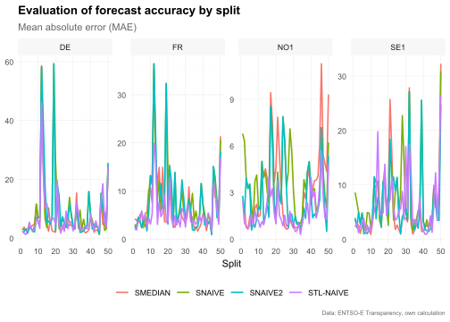

<!-- README.md is generated from README.Rmd. Please edit that file -->

# tscv

<!-- badges: start -->

[](https://www.tidyverse.org/lifecycle/#experimental)
<!-- badges: end -->

The package `tscv` provides a collection of functions and tools for time
series analysis and forecasting as well as time series cross-validation.
This is mainly a set of wrapper and helper functions as well as some
extensions for the packages `tsibble`, `fable` and `fabletools` that I
find useful for research in the area of time series forecasting.

## Installation

You can install the development version from
[GitHub](https://github.com/) with:

``` r
# install.packages("devtools")
devtools::install_github("ahaeusser/tscv")
```

## Example

``` r
# Load relevant packages
library(tscv)
library(tidyverse)
library(tsibble)
library(fable)
library(feasts)
```

## Data preparation

The dataset `elec_price` is a hourly `tsibble` with day-ahead
electricity spot prices in \[EUR/MWh\] from the ENTSO-E Transparency
Platform. The dataset contains time series data from 2019-01-01 to
2019-12-31 for 8 european bidding zones (BZN):

-   DE: Germany (including Luxembourg)
-   DK: Denmark
-   ES: Spain
-   FI: Finland
-   FR: France
-   NL: Netherlands
-   NO1: Norway 1 (Oslo)
-   SE1: Sweden 1 (Lulea)

In this vignette, we will use only four time series to demonstrate the
functionality of the package (the data set is filtered to the bidding
zones Germany, France, Norway 1 and Sweden 1). You can use the function
`clean_data()` to prepare the dataset for further usage. The function
checks whether the input data are a valid tsibble or not (regular spaced
in time and ordered). Furthermore, implicit missing values are turned
into explicit missing values (existing missing values are left
untouched). If the data are provided in wide format, they are gathered
into long format. You can use the function `plot_line()` to visualize
the four time series.

``` r
# Prepare dataset
data <- elec_price %>%
  filter(BZN %in% c("DE", "FR", "NO1", "SE1")) %>%
  check_data()

data
#> # A tsibble: 35,040 x 5 [1h] <UTC>
#> # Key:       Series, Unit, BZN [4]
#>    Time                Series           Unit      BZN    Value
#>    <dttm>              <chr>            <chr>     <chr>  <dbl>
#>  1 2019-01-01 00:00:00 Day-ahead Prices [EUR/MWh] DE     10.1 
#>  2 2019-01-01 01:00:00 Day-ahead Prices [EUR/MWh] DE     -4.08
#>  3 2019-01-01 02:00:00 Day-ahead Prices [EUR/MWh] DE     -9.91
#>  4 2019-01-01 03:00:00 Day-ahead Prices [EUR/MWh] DE     -7.41
#>  5 2019-01-01 04:00:00 Day-ahead Prices [EUR/MWh] DE    -12.6 
#>  6 2019-01-01 05:00:00 Day-ahead Prices [EUR/MWh] DE    -17.2 
#>  7 2019-01-01 06:00:00 Day-ahead Prices [EUR/MWh] DE    -15.1 
#>  8 2019-01-01 07:00:00 Day-ahead Prices [EUR/MWh] DE     -4.93
#>  9 2019-01-01 08:00:00 Day-ahead Prices [EUR/MWh] DE     -6.33
#> 10 2019-01-01 09:00:00 Day-ahead Prices [EUR/MWh] DE     -4.93
#> # ... with 35,030 more rows

data %>%
  plot_line(
    x = Time,
    y = Value,
    color = BZN,
    facet_var = BZN,
    title = "Day-ahead Electricity Spot Price",
    subtitle = "2019-03-01 to 2019-03-15",
    xlab = "Time",
    ylab = "[EUR/MWh]",
    caption = "Data: ENTSO-E Transparency")
```


## Split data into training and testing

To prepare the dataset for time series cross-validation (TSCV), you can
use the function `split_data()`. This function splits the data into
training and testing (i.e. partitioning into time slices) for time
series cross-validation. You can choose between `stretch` and `slide`.
The first is an expanding window approach, while the latter is a fixed
window approach. Furthermore, you can define the (initial) window size
for training and testing via `n_init` and `n_ahead`, as well as the step
size for increments via `n_skip`.

``` r
# Setup for time series cross validation
n_init <- 2400   # size for training window
n_ahead <- 24    # size for testing window (forecast horizon)
mode <- "slide"  # fixed window approach
n_skip <- 23     # skip 23 observations
n_lag <- 0       # no lag

data <- data %>%
  split_data(
    n_init = n_init,
    n_ahead = n_ahead,
    mode = mode,
    n_skip = n_skip,
    n_lag = n_lag)

train <- data$train
train
#> # A tsibble: 2,553,600 x 9 [1h] <UTC>
#> # Key:       Series, Unit, BZN, split [1,064]
#>    Time                Series     Unit   BZN    Value split    id sample horizon
#>    <dttm>              <chr>      <chr>  <chr>  <dbl> <int> <int> <chr>    <int>
#>  1 2019-01-01 00:00:00 Day-ahead~ [EUR/~ DE     10.1      1     1 train       NA
#>  2 2019-01-01 01:00:00 Day-ahead~ [EUR/~ DE     -4.08     1     2 train       NA
#>  3 2019-01-01 02:00:00 Day-ahead~ [EUR/~ DE     -9.91     1     3 train       NA
#>  4 2019-01-01 03:00:00 Day-ahead~ [EUR/~ DE     -7.41     1     4 train       NA
#>  5 2019-01-01 04:00:00 Day-ahead~ [EUR/~ DE    -12.6      1     5 train       NA
#>  6 2019-01-01 05:00:00 Day-ahead~ [EUR/~ DE    -17.2      1     6 train       NA
#>  7 2019-01-01 06:00:00 Day-ahead~ [EUR/~ DE    -15.1      1     7 train       NA
#>  8 2019-01-01 07:00:00 Day-ahead~ [EUR/~ DE     -4.93     1     8 train       NA
#>  9 2019-01-01 08:00:00 Day-ahead~ [EUR/~ DE     -6.33     1     9 train       NA
#> 10 2019-01-01 09:00:00 Day-ahead~ [EUR/~ DE     -4.93     1    10 train       NA
#> # ... with 2,553,590 more rows

test <- data$test
test
#> # A tsibble: 25,536 x 9 [1h] <UTC>
#> # Key:       Series, Unit, BZN, split [1,064]
#>    Time                Series      Unit   BZN   Value split    id sample horizon
#>    <dttm>              <chr>       <chr>  <chr> <dbl> <int> <int> <chr>    <int>
#>  1 2019-04-11 00:00:00 Day-ahead ~ [EUR/~ DE     37.1     1  2401 test         1
#>  2 2019-04-11 01:00:00 Day-ahead ~ [EUR/~ DE     36.5     1  2402 test         2
#>  3 2019-04-11 02:00:00 Day-ahead ~ [EUR/~ DE     37.1     1  2403 test         3
#>  4 2019-04-11 03:00:00 Day-ahead ~ [EUR/~ DE     38.9     1  2404 test         4
#>  5 2019-04-11 04:00:00 Day-ahead ~ [EUR/~ DE     47.9     1  2405 test         5
#>  6 2019-04-11 05:00:00 Day-ahead ~ [EUR/~ DE     56.4     1  2406 test         6
#>  7 2019-04-11 06:00:00 Day-ahead ~ [EUR/~ DE     59.2     1  2407 test         7
#>  8 2019-04-11 07:00:00 Day-ahead ~ [EUR/~ DE     51.7     1  2408 test         8
#>  9 2019-04-11 08:00:00 Day-ahead ~ [EUR/~ DE     48.6     1  2409 test         9
#> 10 2019-04-11 09:00:00 Day-ahead ~ [EUR/~ DE     46.0     1  2410 test        10
#> # ... with 25,526 more rows
```

The function `summarise_split()` provides a summary table of the
partitioning into training and testing with the corresponding start and
end (as date and index) for each split. This is very useful to identify
specific splits by date. For example, if a holiday falls into a specific
testing slice or not.

``` r
# Summarize split into training and testing data
data$index
#> # A tibble: 266 x 2
#>    train_index   test_index
#>    <list>        <list>    
#>  1 <int [2,400]> <int [24]>
#>  2 <int [2,400]> <int [24]>
#>  3 <int [2,400]> <int [24]>
#>  4 <int [2,400]> <int [24]>
#>  5 <int [2,400]> <int [24]>
#>  6 <int [2,400]> <int [24]>
#>  7 <int [2,400]> <int [24]>
#>  8 <int [2,400]> <int [24]>
#>  9 <int [2,400]> <int [24]>
#> 10 <int [2,400]> <int [24]>
#> # ... with 256 more rows
```

## Training and forecasting

The data are splitted into training and testing slices and we are ready
to forecast. Due to the sample size and computation time, only very
simple benchmark methods are used. The functions `SMEDIAN` and `SMEAN`
are extensions to the `fable` package. The function `SMEAN` is exactly
the same as running a regression against seasonal dummy variables
(`TSLM(value ~ season())`). I just added this function for convenience.
Further forecasting methods are available (e.g. `TBATS()` and `DSHW()`
from package `forecast` or `ELM()` and `MLP()` from package `nnfor`).

``` r
# Model training
train <- train %>%
  filter(split %in% c(1:100))

models <- train %>%
  model(
    sNaive = SNAIVE(Value ~ lag("week")),
    sMean = SMEAN(Value ~ lag("week")),
    sMedian = SMEDIAN(Value ~ lag("week")),
    "STL-Naive" = decomposition_model(STL(Value), NAIVE(season_adjust)))

models
#> # A mable: 400 x 8
#> # Key:     Series, Unit, BZN, split [400]
#>    Series Unit  BZN   split   sNaive   sMean   sMedian               `STL-Naive`
#>    <chr>  <chr> <chr> <int>  <model> <model>   <model>                   <model>
#>  1 Day-a~ [EUR~ DE        1 <SNAIVE> <SMEAN> <SMEDIAN> <STL decomposition model>
#>  2 Day-a~ [EUR~ DE        2 <SNAIVE> <SMEAN> <SMEDIAN> <STL decomposition model>
#>  3 Day-a~ [EUR~ DE        3 <SNAIVE> <SMEAN> <SMEDIAN> <STL decomposition model>
#>  4 Day-a~ [EUR~ DE        4 <SNAIVE> <SMEAN> <SMEDIAN> <STL decomposition model>
#>  5 Day-a~ [EUR~ DE        5 <SNAIVE> <SMEAN> <SMEDIAN> <STL decomposition model>
#>  6 Day-a~ [EUR~ DE        6 <SNAIVE> <SMEAN> <SMEDIAN> <STL decomposition model>
#>  7 Day-a~ [EUR~ DE        7 <SNAIVE> <SMEAN> <SMEDIAN> <STL decomposition model>
#>  8 Day-a~ [EUR~ DE        8 <SNAIVE> <SMEAN> <SMEDIAN> <STL decomposition model>
#>  9 Day-a~ [EUR~ DE        9 <SNAIVE> <SMEAN> <SMEDIAN> <STL decomposition model>
#> 10 Day-a~ [EUR~ DE       10 <SNAIVE> <SMEAN> <SMEDIAN> <STL decomposition model>
#> # ... with 390 more rows

# Forecasting
fcst <- models %>%
  forecast(h = n_ahead)

fcst
#> # A fable: 38,400 x 8 [1h] <UTC>
#> # Key:     Series, Unit, BZN, split, .model [1,600]
#>    Series        Unit    BZN   split .model Time                     Value .mean
#>    <chr>         <chr>   <chr> <int> <chr>  <dttm>                  <dist> <dbl>
#>  1 Day-ahead Pr~ [EUR/M~ DE        1 sNaive 2019-04-11 00:00:00 N(33, 367)  33  
#>  2 Day-ahead Pr~ [EUR/M~ DE        1 sNaive 2019-04-11 01:00:00 N(33, 367)  32.6
#>  3 Day-ahead Pr~ [EUR/M~ DE        1 sNaive 2019-04-11 02:00:00 N(34, 367)  34.1
#>  4 Day-ahead Pr~ [EUR/M~ DE        1 sNaive 2019-04-11 03:00:00 N(37, 367)  36.9
#>  5 Day-ahead Pr~ [EUR/M~ DE        1 sNaive 2019-04-11 04:00:00 N(45, 367)  44.7
#>  6 Day-ahead Pr~ [EUR/M~ DE        1 sNaive 2019-04-11 05:00:00 N(54, 367)  53.6
#>  7 Day-ahead Pr~ [EUR/M~ DE        1 sNaive 2019-04-11 06:00:00 N(60, 367)  59.9
#>  8 Day-ahead Pr~ [EUR/M~ DE        1 sNaive 2019-04-11 07:00:00 N(47, 367)  46.9
#>  9 Day-ahead Pr~ [EUR/M~ DE        1 sNaive 2019-04-11 08:00:00 N(48, 367)  48  
#> 10 Day-ahead Pr~ [EUR/M~ DE        1 sNaive 2019-04-11 09:00:00 N(47, 367)  47  
#> # ... with 38,390 more rows

plot_forecast(
  fcst = fcst,
  data = bind_rows(train, test),
  include = 48,
  split = c(10, 11),
  title = "Day-ahead electricity spot price forecast",
  subtitle = "Rolling forecasts for splits 10 and 11",
  ylab = "[EUR/MWh]",
  caption = "Data: ENTSO-E Transparency, own calculation"
  )
```


## Evaluation of forecast accuracy

To evaluate the forecast accuracy, the function `error_metrics()` is
used. You can define whether to evaluate the accuracy by `horizon` or by
`split`. Several accuracy metrics are available:

-   `ME`: mean error
-   `MAE`: mean absolute error
-   `MSE`: mean squared error
-   `RMSE`: root mean squared error
-   `MAPE`: mean absolute percentage error
-   `sMAPE`: scaled mean absolute percentage error
-   `MPE`: mean percentage error
-   `MASE`: mean absolute scale error

### Forecast accuracy by forecast horizon

``` r
# Estimate error metrics
metrics_horizon <- error_metrics(
  fcst = fcst,
  test = test,
  train = train,
  period = 168,
  by = "horizon")

metrics_horizon <- metrics_horizon %>%
  filter(metric %in% c("MAE", "MASE"))

metrics_horizon
#> # A tibble: 768 x 8
#>    Series           Unit      BZN   .model dimension     n metric value
#>    <chr>            <chr>     <chr> <chr>  <chr>     <int> <chr>  <dbl>
#>  1 Day-ahead Prices [EUR/MWh] DE    sMean  horizon       1 MAE     5.57
#>  2 Day-ahead Prices [EUR/MWh] DE    sMean  horizon       2 MAE     5.80
#>  3 Day-ahead Prices [EUR/MWh] DE    sMean  horizon       3 MAE     5.94
#>  4 Day-ahead Prices [EUR/MWh] DE    sMean  horizon       4 MAE     5.84
#>  5 Day-ahead Prices [EUR/MWh] DE    sMean  horizon       5 MAE     7.36
#>  6 Day-ahead Prices [EUR/MWh] DE    sMean  horizon       6 MAE     7.69
#>  7 Day-ahead Prices [EUR/MWh] DE    sMean  horizon       7 MAE     7.42
#>  8 Day-ahead Prices [EUR/MWh] DE    sMean  horizon       8 MAE     7.45
#>  9 Day-ahead Prices [EUR/MWh] DE    sMean  horizon       9 MAE     7.89
#> 10 Day-ahead Prices [EUR/MWh] DE    sMean  horizon      10 MAE     9.13
#> # ... with 758 more rows

# Visualize results
metrics_horizon %>%
  plot_error_metrics(
    title = "Evaluation of forecast accuracy by forecast horizon",
    subtitle = "Mean absolute scaled error (MASE)",
    xlab = "Forecast horizon (n-step-ahead)",
    caption = "Data: ENTSO-E Transparency, own calculation")
```


### Forecast accuracy by split

``` r
# Estimate error metrics
metrics_split <- error_metrics(
  fcst = fcst,
  test = test,
  train = train,
  period = 168,
  by = "split")

metrics_split <- metrics_split %>%
  filter(metric %in% c("MAE", "MASE"))

metrics_split
#> # A tibble: 3,200 x 8
#>    Series           Unit      BZN   .model dimension     n metric value
#>    <chr>            <chr>     <chr> <chr>  <chr>     <int> <chr>  <dbl>
#>  1 Day-ahead Prices [EUR/MWh] DE    sMean  split         1 MAE     5.40
#>  2 Day-ahead Prices [EUR/MWh] DE    sMean  split         2 MAE     4.75
#>  3 Day-ahead Prices [EUR/MWh] DE    sMean  split         3 MAE     5.44
#>  4 Day-ahead Prices [EUR/MWh] DE    sMean  split         4 MAE     5.99
#>  5 Day-ahead Prices [EUR/MWh] DE    sMean  split         5 MAE     7.04
#>  6 Day-ahead Prices [EUR/MWh] DE    sMean  split         6 MAE     5.17
#>  7 Day-ahead Prices [EUR/MWh] DE    sMean  split         7 MAE     5.19
#>  8 Day-ahead Prices [EUR/MWh] DE    sMean  split         8 MAE     8.01
#>  9 Day-ahead Prices [EUR/MWh] DE    sMean  split         9 MAE    11.7 
#> 10 Day-ahead Prices [EUR/MWh] DE    sMean  split        10 MAE     5.44
#> # ... with 3,190 more rows

# Visualize results
metrics_split %>%
  plot_error_metrics(
    title = "Evaluation of forecast accuracy by split",
    subtitle = "Mean absolute scaled error (MASE)",
    xlab = "Split",
    caption = "Data: ENTSO-E Transparency, own calculation")
```


