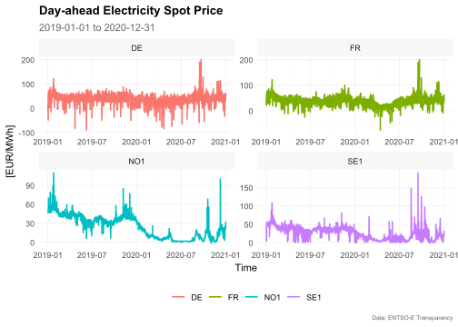

<!-- README.md is generated from README.Rmd. Please edit that file -->

# tscv

<!-- badges: start -->

[](https://www.tidyverse.org/lifecycle/#experimental)
<!-- badges: end -->

The package `tscv` provides a collection of functions and tools for time
series analysis and forecasting as well as time series cross-validation.
This is mainly a set of wrapper and helper functions as well as some
extensions for the packages `tsibble`, `fable` and `fabletools` that I
find useful for research in the area of time series forecasting.

## Installation

You can install the development version from
[GitHub](https://github.com/) with:

``` r
# install.packages("devtools")
devtools::install_github("ahaeusser/tscv")
```

## Example

``` r
# Load relevant packages
library(tscv)
library(tidyverse)
library(tsibble)
library(fable)
library(feasts)
Sys.setlocale("LC_TIME", "C")
#> [1] "C"
```

## Data preparation

The dataset `elec_price` is a hourly `tsibble` with day-ahead
electricity spot prices in \[EUR/MWh\] from the ENTSO-E Transparency
Platform. The dataset contains time series data from 2019-01-01 to
2019-12-31 for four european bidding zones:

  - DE-LU: Germany and Luxembourg
  - FR: France
  - NO1: Norway 1 (Oslo)
  - SE1: Sweden 1 (Lulea)

You can use the function `clean_data()` to prepare the dataset for
further usage. The function checks whether the input data are a valid
tsibble or not (regular spaced in time and ordered). Furthermore,
implicit missing values are turned into explicit missing values
(existing missing values are left untouched). If the data are provided
in wide format, they are gathered into long format. You can use the
function `plot_line()` to visualize the four time series.

``` r
# Prepare dataset
data <- elec_price %>%
  mutate(Series = paste0(Series, " (", BZN, ")")) %>%
  update_tsibble(key = Series) %>%
  select(-c(Unit, BZN)) %>%
  clean_data()

data
#> # A tsibble: 35,040 x 3 [1h] <UTC>
#> # Key:       Series [4]
#>    Time                Series         Value
#>    <dttm>              <chr>          <dbl>
#>  1 2019-01-01 00:00:00 Price (DE-LU)  10.1 
#>  2 2019-01-01 01:00:00 Price (DE-LU)  -4.08
#>  3 2019-01-01 02:00:00 Price (DE-LU)  -9.91
#>  4 2019-01-01 03:00:00 Price (DE-LU)  -7.41
#>  5 2019-01-01 04:00:00 Price (DE-LU) -12.6 
#>  6 2019-01-01 05:00:00 Price (DE-LU) -17.2 
#>  7 2019-01-01 06:00:00 Price (DE-LU) -15.1 
#>  8 2019-01-01 07:00:00 Price (DE-LU)  -4.93
#>  9 2019-01-01 08:00:00 Price (DE-LU)  -6.33
#> 10 2019-01-01 09:00:00 Price (DE-LU)  -4.93
#> # ... with 35,030 more rows

data %>%
  plot_line(
    x = Time,
    y = Value,
    color = Series,
    title = "Day-ahead Electricity Spot Price",
    subtitle = "2019-03-01 to 2019-03-15",
    xlab = "Time",
    ylab = "[EUR/MWh]",
    caption = "Data: ENTSO-E Transparency")
```



## Split data into training and testing

To prepare the dataset for time series cross-validation (TSCV), you can
use the function `split_data()`. This function splits the data into
training and testing (i.e. partitioning into time slices) for time
series cross-validation. You can choose between `stretch` and `slide`.
The first is an expanding window approach, while the latter is a fixed
window approach. Furthermore, you can define the (initial) window size
for training and testing via `n_init` and `n_ahead`, as well as the step
size for increments via `n_skip`.

``` r
# Setup for time series cross validation
n_init <- 2400   # size for training window
n_ahead <- 24    # size for testing window (forecast horizon)
mode <- "slide"  # fixed window approach
n_skip <- 23     # skip 23 observations
n_lag <- 0       # no lag

data <- data %>%
  split_data(
    n_init = n_init,
    n_ahead = n_ahead,
    mode = mode,
    n_skip = n_skip,
    n_lag = n_lag)

data
#> # A tsibble: 2,579,136 x 7 [1h] <UTC>
#> # Key:       Series, split [1,064]
#>    Time                Series         Value split    id sample horizon
#>    <dttm>              <chr>          <dbl> <int> <int> <chr>    <int>
#>  1 2019-01-01 00:00:00 Price (DE-LU)  10.1      1     1 train       NA
#>  2 2019-01-01 01:00:00 Price (DE-LU)  -4.08     1     2 train       NA
#>  3 2019-01-01 02:00:00 Price (DE-LU)  -9.91     1     3 train       NA
#>  4 2019-01-01 03:00:00 Price (DE-LU)  -7.41     1     4 train       NA
#>  5 2019-01-01 04:00:00 Price (DE-LU) -12.6      1     5 train       NA
#>  6 2019-01-01 05:00:00 Price (DE-LU) -17.2      1     6 train       NA
#>  7 2019-01-01 06:00:00 Price (DE-LU) -15.1      1     7 train       NA
#>  8 2019-01-01 07:00:00 Price (DE-LU)  -4.93     1     8 train       NA
#>  9 2019-01-01 08:00:00 Price (DE-LU)  -6.33     1     9 train       NA
#> 10 2019-01-01 09:00:00 Price (DE-LU)  -4.93     1    10 train       NA
#> # ... with 2,579,126 more rows
```

The function `summarise_split()` provides a summary table of the
partitioning into training and testing with the corresponding start and
end (as date and index) for each split. This is very useful to identfy
specific splits by date. For example, if a holiday falls into a specific
testing slice or not.

``` r
# Summarize split into training and testing data
data %>% summarise_split()
#> # A tibble: 266 x 5
#>    split time_train              time_test               index_train index_test 
#>    <int> <chr>                   <chr>                   <chr>       <chr>      
#>  1     1 [2019-01-01, 2019-04-1~ [2019-04-11, 2019-04-1~ [0001, 240~ [2401, 242~
#>  2     2 [2019-01-02, 2019-04-1~ [2019-04-12, 2019-04-1~ [0025, 242~ [2425, 244~
#>  3     3 [2019-01-03, 2019-04-1~ [2019-04-13, 2019-04-1~ [0049, 244~ [2449, 247~
#>  4     4 [2019-01-04, 2019-04-1~ [2019-04-14, 2019-04-1~ [0073, 247~ [2473, 249~
#>  5     5 [2019-01-05, 2019-04-1~ [2019-04-15, 2019-04-1~ [0097, 249~ [2497, 252~
#>  6     6 [2019-01-06, 2019-04-1~ [2019-04-16, 2019-04-1~ [0121, 252~ [2521, 254~
#>  7     7 [2019-01-07, 2019-04-1~ [2019-04-17, 2019-04-1~ [0145, 254~ [2545, 256~
#>  8     8 [2019-01-08, 2019-04-1~ [2019-04-18, 2019-04-1~ [0169, 256~ [2569, 259~
#>  9     9 [2019-01-09, 2019-04-1~ [2019-04-19, 2019-04-1~ [0193, 259~ [2593, 261~
#> 10    10 [2019-01-10, 2019-04-1~ [2019-04-20, 2019-04-2~ [0217, 261~ [2617, 264~
#> # ... with 256 more rows
```

## Training and forecasting

The data are splitted into training and testing slices and we are ready
to forecast. Due to the sample size and computation time, only very
simple benchmark methods are used. The functions `SMEDIAN` and `SMEAN`
are extensions to the `fable` package. The function `SMEAN` is exactly
the same as running a regression against seasonal dummy variables
(`TSLM(value ~ season())`). I just added this function for convenience.
Further forecasting methods are available (e.g. `TBATS()` and `DSHW()`
from package `forecast` or `ELM()` and `MLP()` from package `nnfor`).

``` r
# Model training
data <- data %>%
  filter(split %in% c(1:100))

models <- data %>%
  filter(sample == "train") %>%
  model(
    sNaive = SNAIVE(Value ~ lag("week")),
    sMean = SMEAN(Value ~ lag("week")),
    sMedian = SMEDIAN(Value ~ lag("week")),
    "STL-Naive" = decomposition_model(STL(Value), NAIVE(season_adjust)))

models
#> # A mable: 400 x 6
#> # Key:     Series, split [400]
#>    Series        split sNaive   sMean   sMedian   `STL-Naive`              
#>    <chr>         <int> <model>  <model> <model>   <model>                  
#>  1 Price (DE-LU)     1 <SNAIVE> <SMEAN> <SMEDIAN> <STL decomposition model>
#>  2 Price (DE-LU)     2 <SNAIVE> <SMEAN> <SMEDIAN> <STL decomposition model>
#>  3 Price (DE-LU)     3 <SNAIVE> <SMEAN> <SMEDIAN> <STL decomposition model>
#>  4 Price (DE-LU)     4 <SNAIVE> <SMEAN> <SMEDIAN> <STL decomposition model>
#>  5 Price (DE-LU)     5 <SNAIVE> <SMEAN> <SMEDIAN> <STL decomposition model>
#>  6 Price (DE-LU)     6 <SNAIVE> <SMEAN> <SMEDIAN> <STL decomposition model>
#>  7 Price (DE-LU)     7 <SNAIVE> <SMEAN> <SMEDIAN> <STL decomposition model>
#>  8 Price (DE-LU)     8 <SNAIVE> <SMEAN> <SMEDIAN> <STL decomposition model>
#>  9 Price (DE-LU)     9 <SNAIVE> <SMEAN> <SMEDIAN> <STL decomposition model>
#> 10 Price (DE-LU)    10 <SNAIVE> <SMEAN> <SMEDIAN> <STL decomposition model>
#> # ... with 390 more rows

# Forecasting
fcst <- models %>%
  forecast(h = n_ahead)

fcst
#> # A fable: 38,400 x 6 [1h] <UTC>
#> # Key:     Series, split, .model [1,600]
#>    Series        split .model Time                Value .distribution
#>    <chr>         <int> <chr>  <dttm>              <dbl> <dist>       
#>  1 Price (DE-LU)     1 sNaive 2019-04-11 00:00:00  33   N(33, 367)   
#>  2 Price (DE-LU)     1 sNaive 2019-04-11 01:00:00  32.6 N(33, 367)   
#>  3 Price (DE-LU)     1 sNaive 2019-04-11 02:00:00  34.1 N(34, 367)   
#>  4 Price (DE-LU)     1 sNaive 2019-04-11 03:00:00  36.9 N(37, 367)   
#>  5 Price (DE-LU)     1 sNaive 2019-04-11 04:00:00  44.7 N(45, 367)   
#>  6 Price (DE-LU)     1 sNaive 2019-04-11 05:00:00  53.6 N(54, 367)   
#>  7 Price (DE-LU)     1 sNaive 2019-04-11 06:00:00  59.9 N(60, 367)   
#>  8 Price (DE-LU)     1 sNaive 2019-04-11 07:00:00  46.9 N(47, 367)   
#>  9 Price (DE-LU)     1 sNaive 2019-04-11 08:00:00  48   N(48, 367)   
#> 10 Price (DE-LU)     1 sNaive 2019-04-11 09:00:00  47   N(47, 367)   
#> # ... with 38,390 more rows

plot_forecast(
  fcst = fcst,
  data = data,
  include = 48,
  split = c(10, 11),
  title = "Day-ahead electricity spot price forecast",
  subtitle = "Rolling forecasts for splits 10 and 11",
  ylab = "[EUR/MWh]",
  caption = "Data: ENTSO-E Transparency, own calculation"
  )
```


## Evaluation of forecast accuracy

To evaluate the forecast accuracy, the function `error_metrics()` is
used. You can define whether to evaluate the accuracy by `horizon` or by
`split`. Several accuracy metrics are available:

  - `ME`: mean error
  - `MAE`: mean absolute error
  - `MSE`: mean squared error
  - `RMSE`: root mean squared error
  - `MAPE`: mean absolute percentage error
  - `sMAPE`: scaled mean absolute percentage error
  - `MPE`: mean percentage error
  - `MASE`: mean absolute scale error
  - `sMASE`: seasonal mean absolute scaled error

### Forecast accuracy by forecast horizon

``` r
# Estimate error metrics
metrics_horizon <- error_metrics(
  fcst = fcst,
  data = data,
  period = 168,
  by = "horizon")

metrics_horizon
#> # A tibble: 3,456 x 5
#>    Series        .model horizon metric value
#>    <chr>         <chr>    <int> <chr>  <dbl>
#>  1 Price (DE-LU) sMean        1 MAE     5.57
#>  2 Price (DE-LU) sMean        2 MAE     5.80
#>  3 Price (DE-LU) sMean        3 MAE     5.94
#>  4 Price (DE-LU) sMean        4 MAE     5.84
#>  5 Price (DE-LU) sMean        5 MAE     7.36
#>  6 Price (DE-LU) sMean        6 MAE     7.69
#>  7 Price (DE-LU) sMean        7 MAE     7.42
#>  8 Price (DE-LU) sMean        8 MAE     7.45
#>  9 Price (DE-LU) sMean        9 MAE     7.89
#> 10 Price (DE-LU) sMean       10 MAE     9.13
#> # ... with 3,446 more rows

# Visualize results
metrics_horizon %>%
  plot_error_metrics(
    title = "Evaluation of forecast accuracy by forecast horizon",
    subtitle = "Seasonal mean absolute scaled error (sMASE)",
    xlab = "Forecast horizon (n-step-ahead)",
    caption = "Data: ENTSO-E Transparency, own calculation")
```


### Forecast accuracy by split

``` r
# Estimate error metrics
metrics_split <- error_metrics(
  fcst = fcst,
  data = data,
  period = 168,
  by = "split")

metrics_split
#> # A tibble: 14,400 x 5
#>    Series        .model split metric value
#>    <chr>         <chr>  <int> <chr>  <dbl>
#>  1 Price (DE-LU) sMean      1 MAE     5.40
#>  2 Price (DE-LU) sMean      2 MAE     4.75
#>  3 Price (DE-LU) sMean      3 MAE     5.44
#>  4 Price (DE-LU) sMean      4 MAE     5.99
#>  5 Price (DE-LU) sMean      5 MAE     7.04
#>  6 Price (DE-LU) sMean      6 MAE     5.17
#>  7 Price (DE-LU) sMean      7 MAE     5.19
#>  8 Price (DE-LU) sMean      8 MAE     8.01
#>  9 Price (DE-LU) sMean      9 MAE    11.7 
#> 10 Price (DE-LU) sMean     10 MAE     5.44
#> # ... with 14,390 more rows

# Visualize results
metrics_split %>%
  plot_error_metrics(
    title = "Evaluation of forecast accuracy by split",
    subtitle = "Seasonal mean absolute scaled error (sMASE)",
    xlab = "Split",
    caption = "Data: ENTSO-E Transparency, own calculation")
```


