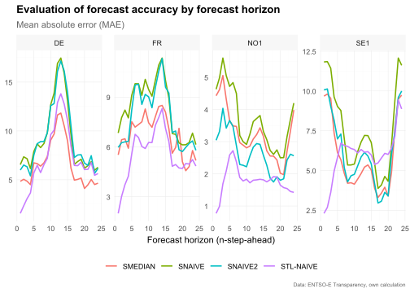

<!-- README.md is generated from README.Rmd. Please edit that file -->

# tscv

<!-- badges: start -->

[](https://www.tidyverse.org/lifecycle/#experimental)
[](https://www.gnu.org/licenses/gpl-3.0.en.html)
<!-- badges: end -->

The package `tscv` provides a collection of functions and tools for time
series analysis and forecasting as well as time series cross-validation.
This is mainly a set of wrapper and helper functions as well as some
extensions for the packages `tsibble`, `fable` and `fabletools` that I
find useful for research in the area of time series forecasting.

***Disclaimer:*** The `tscv` package is highly experimental and it is
very likely that there will be (substantial) changes in the near future.

## Installation

You can install the development version from
[GitHub](https://github.com/) with:

``` r
# install.packages("devtools")
devtools::install_github("ahaeusser/tscv")
```

## Example

``` r
# Load relevant packages
library(tscv)
library(tidyverse)
library(tsibble)
library(fable)
library(feasts)
```

## Data preparation

The data set `elec_price` is a `tibble` with day-ahead electricity spot
prices in \[EUR/MWh\] from the ENTSO-E Transparency Platform. The data
set contains hourly time series data from 2019-01-01 to 2020-12-31 for 8
European bidding zones (BZN):

- DE: Germany (including Luxembourg)
- DK: Denmark
- ES: Spain
- FI: Finland
- FR: France
- NL: Netherlands
- NO1: Norway 1 (Oslo)
- SE1: Sweden 1 (Lulea)

In this vignette, we will use only four time series to demonstrate the
functionality of the package (the data set is filtered to the bidding
zones Germany, France, Norway and Sweden). You can use the function
`plot_line()` to visualize the four time series. The function
`summarise_data()` is used to explore the structure (start date, end
date, number of observations and the number missing and zero values).
The function `summarise_stats()` calculates descriptive statistics for
each time series.

``` r

series_id = "bidding_zone"
value_id = "value"
index_id = "time"

context <- list(
  series_id = series_id,
  value_id = value_id,
  index_id = index_id
)

# Prepare data set
main_frame <- elec_price %>%
  filter(bidding_zone %in% c("DE", "FR", "NO1", "SE1"))

main_frame
#> # A tibble: 70,176 × 5
#>    time                item            unit      bidding_zone  value
#>    <dttm>              <chr>           <chr>     <chr>         <dbl>
#>  1 2019-01-01 00:00:00 Day-ahead Price [EUR/MWh] DE            10.1 
#>  2 2019-01-01 01:00:00 Day-ahead Price [EUR/MWh] DE            -4.08
#>  3 2019-01-01 02:00:00 Day-ahead Price [EUR/MWh] DE            -9.91
#>  4 2019-01-01 03:00:00 Day-ahead Price [EUR/MWh] DE            -7.41
#>  5 2019-01-01 04:00:00 Day-ahead Price [EUR/MWh] DE           -12.6 
#>  6 2019-01-01 05:00:00 Day-ahead Price [EUR/MWh] DE           -17.2 
#>  7 2019-01-01 06:00:00 Day-ahead Price [EUR/MWh] DE           -15.1 
#>  8 2019-01-01 07:00:00 Day-ahead Price [EUR/MWh] DE            -4.93
#>  9 2019-01-01 08:00:00 Day-ahead Price [EUR/MWh] DE            -6.33
#> 10 2019-01-01 09:00:00 Day-ahead Price [EUR/MWh] DE            -4.93
#> # ℹ 70,166 more rows

main_frame %>%
  plot_line(
    x = time,
    y = value,
    color = bidding_zone,
    facet_var = bidding_zone,
    title = "Day-ahead Electricity Spot Price",
    subtitle = "2019-01-01 to 2020-12-31",
    xlab = "Time",
    ylab = "[EUR/MWh]",
    caption = "Data: ENTSO-E Transparency"
    )
```


``` r

summarise_data(
  .data = main_frame,
  context = context
)
#> # A tibble: 4 × 8
#>   bidding_zone start               end                 n_obs n_missing
#>   <chr>        <dttm>              <dttm>              <int>     <int>
#> 1 DE           2019-01-01 00:00:00 2020-12-31 23:00:00 17544         0
#> 2 FR           2019-01-01 00:00:00 2020-12-31 23:00:00 17544         0
#> 3 NO1          2019-01-01 00:00:00 2020-12-31 23:00:00 17544         0
#> 4 SE1          2019-01-01 00:00:00 2020-12-31 23:00:00 17544         0
#> # ℹ 3 more variables: pct_missing <dbl>, n_zeros <int>, pct_zeros <dbl>

summarise_stats(
  .data = main_frame,
  context = context
)
#> # A tibble: 4 × 11
#>   bidding_zone  mean median  mode    sd     p0   p25   p75  p100 skewness
#>   <chr>        <dbl>  <dbl> <dbl> <dbl>  <dbl> <dbl> <dbl> <dbl>    <dbl>
#> 1 DE            34.1   35.1 35.9   16.9 -90.0  26.3   43.8  200.   -0.776
#> 2 FR            35.8   36   37.2   15.5 -75.8  26.6   44.9  200.    0.323
#> 3 NO1           24.3   26.9  2.66  17.1  -1.73  6.95  38.8  109.    0.189
#> 4 SE1           26.1   27.9 37.9   15.9  -1.73 11.4   38.5  189.    0.378
#> # ℹ 1 more variable: kurtosis <dbl>
```

## Split data into training and testing

To prepare the data set for time series cross-validation (TSCV), you can
use the function `make_split()`. This function splits the data into
several slices for training and testing (i.e. partitioning into time
slices) for time series cross-validation. You can choose between
`stretch` and `slide`. The first is an expanding window approach, while
the latter is a fixed window approach. Furthermore, we define the
(initial) window size for training and testing via `n_init` and
`n_ahead`, as well as the step size for increments via `n_skip`. Further
options for splitting the data are available via `type` (see function
reference for more details).

``` r

# Setup for time series cross validation
type = "first"
value = 2400      # size for training window
n_ahead = 24      # size for testing window (= forecast horizon)
n_skip = 23       # skip 23 observations
n_lag = 0         # no lag
mode = "slide"    # fixed window approach
exceed = FALSE    # only pseudo out-of-sample forecast

split_frame <- make_split(
  main_frame = main_frame,
  context = context,
  type = type,
  value = value,
  n_ahead = n_ahead,
  n_skip = n_skip,
  n_lag = n_lag,
  mode = mode,
  exceed = exceed
)

# For illustration, only the first 50 splits are used
split_frame <- split_frame %>%
  filter(split %in% c(1:50))

split_frame
#> # A tibble: 200 × 4
#>    bidding_zone split train         test      
#>    <chr>        <int> <list>        <list>    
#>  1 DE               1 <int [2,400]> <int [24]>
#>  2 DE               2 <int [2,400]> <int [24]>
#>  3 DE               3 <int [2,400]> <int [24]>
#>  4 DE               4 <int [2,400]> <int [24]>
#>  5 DE               5 <int [2,400]> <int [24]>
#>  6 DE               6 <int [2,400]> <int [24]>
#>  7 DE               7 <int [2,400]> <int [24]>
#>  8 DE               8 <int [2,400]> <int [24]>
#>  9 DE               9 <int [2,400]> <int [24]>
#> 10 DE              10 <int [2,400]> <int [24]>
#> # ℹ 190 more rows
```

## Training and forecasting

The training and test splits are prepared within `split_frame` and we
are ready for forecasting. The function `slice_train()` slices the data
`main_frame` according to the splits within `split_frame`. As we are
using forecasting methods from the packages `fable` and `fabletools`, we
have to convert the data set `main_frame` from a `tibble` to a
`tsibble`. Due to the sample size and computation time, only very simple
benchmark methods are used:

- `SNAIVE`: Seasonal naive model with weekly seasonality (from package
  `fable`)
- `STL-NAIVE`: STL-decomposition model and naive forecast. The series is
  decomposed via STL and the seasonal adjusted series is predicted via
  the naive approach. Afterwards, seasonal component is added to the
  forecasts (from packages `fable` and `feasts`)
- `SNAIVE2`: Variation of the seasonal naive approach. Mondays,
  Saturdays and Sundays are treated with a weekly lag. Tuesdays,
  Wednesdays, Thursdays and Fridays are treated with a daily lag.
- `SMEDIAN`: Seasonal median model

The functions `SMEDIAN()` and `SNAIVE2()` are extensions to the `fable`
package

``` r

# Slice training data from main_frame according to split_frame
train_frame <- slice_train(
  main_frame = main_frame,
  split_frame = split_frame,
  context = context
  )

train_frame
#> # A tibble: 480,000 × 6
#>    time                item            unit      bidding_zone  value split
#>    <dttm>              <chr>           <chr>     <chr>         <dbl> <int>
#>  1 2019-01-01 00:00:00 Day-ahead Price [EUR/MWh] DE            10.1      1
#>  2 2019-01-01 01:00:00 Day-ahead Price [EUR/MWh] DE            -4.08     1
#>  3 2019-01-01 02:00:00 Day-ahead Price [EUR/MWh] DE            -9.91     1
#>  4 2019-01-01 03:00:00 Day-ahead Price [EUR/MWh] DE            -7.41     1
#>  5 2019-01-01 04:00:00 Day-ahead Price [EUR/MWh] DE           -12.6      1
#>  6 2019-01-01 05:00:00 Day-ahead Price [EUR/MWh] DE           -17.2      1
#>  7 2019-01-01 06:00:00 Day-ahead Price [EUR/MWh] DE           -15.1      1
#>  8 2019-01-01 07:00:00 Day-ahead Price [EUR/MWh] DE            -4.93     1
#>  9 2019-01-01 08:00:00 Day-ahead Price [EUR/MWh] DE            -6.33     1
#> 10 2019-01-01 09:00:00 Day-ahead Price [EUR/MWh] DE            -4.93     1
#> # ℹ 479,990 more rows

# Convert tibble to tsibble
train_frame <- train_frame %>%
  as_tsibble(
    index = time,
    key = c(bidding_zone, split)
    )

train_frame
#> # A tsibble: 480,000 x 6 [1h] <UTC>
#> # Key:       bidding_zone, split [200]
#>    time                item            unit      bidding_zone  value split
#>    <dttm>              <chr>           <chr>     <chr>         <dbl> <int>
#>  1 2019-01-01 00:00:00 Day-ahead Price [EUR/MWh] DE            10.1      1
#>  2 2019-01-01 01:00:00 Day-ahead Price [EUR/MWh] DE            -4.08     1
#>  3 2019-01-01 02:00:00 Day-ahead Price [EUR/MWh] DE            -9.91     1
#>  4 2019-01-01 03:00:00 Day-ahead Price [EUR/MWh] DE            -7.41     1
#>  5 2019-01-01 04:00:00 Day-ahead Price [EUR/MWh] DE           -12.6      1
#>  6 2019-01-01 05:00:00 Day-ahead Price [EUR/MWh] DE           -17.2      1
#>  7 2019-01-01 06:00:00 Day-ahead Price [EUR/MWh] DE           -15.1      1
#>  8 2019-01-01 07:00:00 Day-ahead Price [EUR/MWh] DE            -4.93     1
#>  9 2019-01-01 08:00:00 Day-ahead Price [EUR/MWh] DE            -6.33     1
#> 10 2019-01-01 09:00:00 Day-ahead Price [EUR/MWh] DE            -4.93     1
#> # ℹ 479,990 more rows

# Model training via fabletools::model()
model_frame <- train_frame %>%
  model(
    "SNAIVE" = SNAIVE(value ~ lag("week")),
    "STL-NAIVE" = decomposition_model(STL(value), NAIVE(season_adjust)),
    "SNAIVE2" = SNAIVE2(value),
    "SMEDIAN" = SMEDIAN(value ~ lag("week"))
    )

model_frame
#> # A mable: 200 x 6
#> # Key:     bidding_zone, split [200]
#>    bidding_zone split   SNAIVE               `STL-NAIVE`   SNAIVE2   SMEDIAN
#>    <chr>        <int>  <model>                   <model>   <model>   <model>
#>  1 DE               1 <SNAIVE> <STL decomposition model> <SNAIVE2> <SMEDIAN>
#>  2 DE               2 <SNAIVE> <STL decomposition model> <SNAIVE2> <SMEDIAN>
#>  3 DE               3 <SNAIVE> <STL decomposition model> <SNAIVE2> <SMEDIAN>
#>  4 DE               4 <SNAIVE> <STL decomposition model> <SNAIVE2> <SMEDIAN>
#>  5 DE               5 <SNAIVE> <STL decomposition model> <SNAIVE2> <SMEDIAN>
#>  6 DE               6 <SNAIVE> <STL decomposition model> <SNAIVE2> <SMEDIAN>
#>  7 DE               7 <SNAIVE> <STL decomposition model> <SNAIVE2> <SMEDIAN>
#>  8 DE               8 <SNAIVE> <STL decomposition model> <SNAIVE2> <SMEDIAN>
#>  9 DE               9 <SNAIVE> <STL decomposition model> <SNAIVE2> <SMEDIAN>
#> 10 DE              10 <SNAIVE> <STL decomposition model> <SNAIVE2> <SMEDIAN>
#> # ℹ 190 more rows

# Forecasting via fabletools::forecast()
fable_frame <- model_frame %>%
  forecast(h = n_ahead)

fable_frame
#> # A fable: 19,200 x 6 [1h] <UTC>
#> # Key:     bidding_zone, split, .model [800]
#>    bidding_zone split .model time               
#>    <chr>        <int> <chr>  <dttm>             
#>  1 DE               1 SNAIVE 2019-04-11 00:00:00
#>  2 DE               1 SNAIVE 2019-04-11 01:00:00
#>  3 DE               1 SNAIVE 2019-04-11 02:00:00
#>  4 DE               1 SNAIVE 2019-04-11 03:00:00
#>  5 DE               1 SNAIVE 2019-04-11 04:00:00
#>  6 DE               1 SNAIVE 2019-04-11 05:00:00
#>  7 DE               1 SNAIVE 2019-04-11 06:00:00
#>  8 DE               1 SNAIVE 2019-04-11 07:00:00
#>  9 DE               1 SNAIVE 2019-04-11 08:00:00
#> 10 DE               1 SNAIVE 2019-04-11 09:00:00
#> # ℹ 19,190 more rows
#> # ℹ 2 more variables: value <dist>, .mean <dbl>

# Convert fable_frame (fable) to future_frame (tibble)
future_frame <- make_future(
  fable = fable_frame,
  context = context
  )

future_frame
#> # A tibble: 19,200 × 6
#>    time                bidding_zone model  split horizon point
#>    <dttm>              <chr>        <chr>  <int>   <int> <dbl>
#>  1 2019-04-11 00:00:00 DE           SNAIVE     1       1  33  
#>  2 2019-04-11 01:00:00 DE           SNAIVE     1       2  32.6
#>  3 2019-04-11 02:00:00 DE           SNAIVE     1       3  34.1
#>  4 2019-04-11 03:00:00 DE           SNAIVE     1       4  36.9
#>  5 2019-04-11 04:00:00 DE           SNAIVE     1       5  44.7
#>  6 2019-04-11 05:00:00 DE           SNAIVE     1       6  53.6
#>  7 2019-04-11 06:00:00 DE           SNAIVE     1       7  59.9
#>  8 2019-04-11 07:00:00 DE           SNAIVE     1       8  46.9
#>  9 2019-04-11 08:00:00 DE           SNAIVE     1       9  48  
#> 10 2019-04-11 09:00:00 DE           SNAIVE     1      10  47  
#> # ℹ 19,190 more rows
```

## Evaluation of forecast accuracy

To evaluate the forecast accuracy, the function `make_accuracy()` is
used. You can define whether to evaluate the accuracy by `horizon` or by
`split`. Several accuracy metrics are available:

- `ME`: mean error
- `MAE`: mean absolute error
- `MSE`: mean squared error
- `RMSE`: root mean squared error
- `MAPE`: mean absolute percentage error
- `sMAPE`: scaled mean absolute percentage error
- `MPE`: mean percentage error
- `rMAE`: relative mean absolute error (relative to some user-defined
  benchmark method)

### Forecast accuracy by forecast horizon

``` r

# Estimate accuracy metrics by forecast horizon
accuracy_horizon <- make_accuracy(
  future_frame = future_frame,
  main_frame = main_frame,
  context = context,
  dimension = "horizon"
)

accuracy_horizon
#> # A tibble: 2,688 × 6
#>    bidding_zone model   dimension     n metric value
#>    <chr>        <chr>   <chr>     <int> <chr>  <dbl>
#>  1 DE           SMEDIAN horizon       1 MAE     4.84
#>  2 DE           SMEDIAN horizon       2 MAE     5.05
#>  3 DE           SMEDIAN horizon       3 MAE     4.85
#>  4 DE           SMEDIAN horizon       4 MAE     4.50
#>  5 DE           SMEDIAN horizon       5 MAE     6.73
#>  6 DE           SMEDIAN horizon       6 MAE     6.66
#>  7 DE           SMEDIAN horizon       7 MAE     6.40
#>  8 DE           SMEDIAN horizon       8 MAE     6.73
#>  9 DE           SMEDIAN horizon       9 MAE     7.38
#> 10 DE           SMEDIAN horizon      10 MAE     9.06
#> # ℹ 2,678 more rows

# Visualize results
accuracy_horizon %>%
  filter(metric == "MAE") %>%
  plot_line(
    x = n,
    y = value,
    facet_var = bidding_zone,
    facet_nrow = 1,
    color = model,
    title = "Evaluation of forecast accuracy by forecast horizon",
    subtitle = "Mean absolute error (MAE)",
    xlab = "Forecast horizon (n-step-ahead)",
    caption = "Data: ENTSO-E Transparency, own calculation"
    )
```



### Forecast accuracy by split

``` r

# Estimate accuracy metrics by forecast horizon
accuracy_split <- make_accuracy(
  future_frame = future_frame,
  main_frame = main_frame,
  context = context,
  dimension = "split"
)

accuracy_split
#> # A tibble: 5,600 × 6
#>    bidding_zone model   dimension     n metric value
#>    <chr>        <chr>   <chr>     <int> <chr>  <dbl>
#>  1 DE           SMEDIAN split         1 MAE     2.80
#>  2 DE           SMEDIAN split         2 MAE     3.74
#>  3 DE           SMEDIAN split         3 MAE     2.70
#>  4 DE           SMEDIAN split         4 MAE     2.53
#>  5 DE           SMEDIAN split         5 MAE     4.54
#>  6 DE           SMEDIAN split         6 MAE     3.78
#>  7 DE           SMEDIAN split         7 MAE     4.38
#>  8 DE           SMEDIAN split         8 MAE     4.87
#>  9 DE           SMEDIAN split         9 MAE    11.5 
#> 10 DE           SMEDIAN split        10 MAE     5.02
#> # ℹ 5,590 more rows

# Visualize results
accuracy_split %>%
  filter(metric == "MAE") %>%
  plot_line(
    x = n,
    y = value,
    facet_var = bidding_zone,
    facet_nrow = 1,
    color = model,
    title = "Evaluation of forecast accuracy by split",
    subtitle = "Mean absolute error (MAE)",
    xlab = "Split",
    caption = "Data: ENTSO-E Transparency, own calculation"
    )
```


