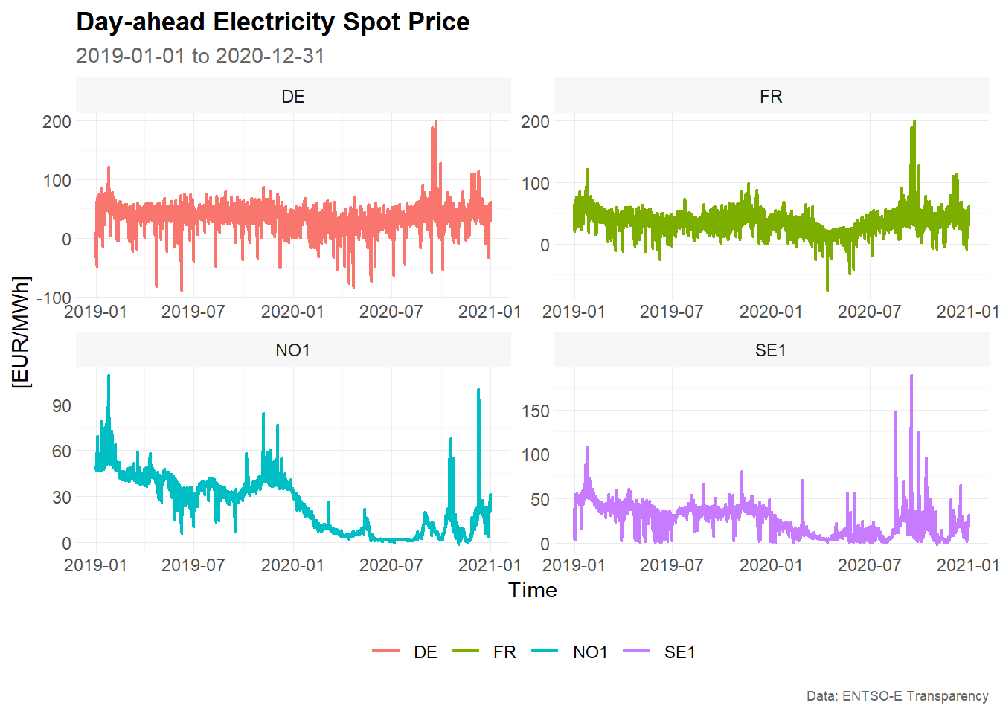
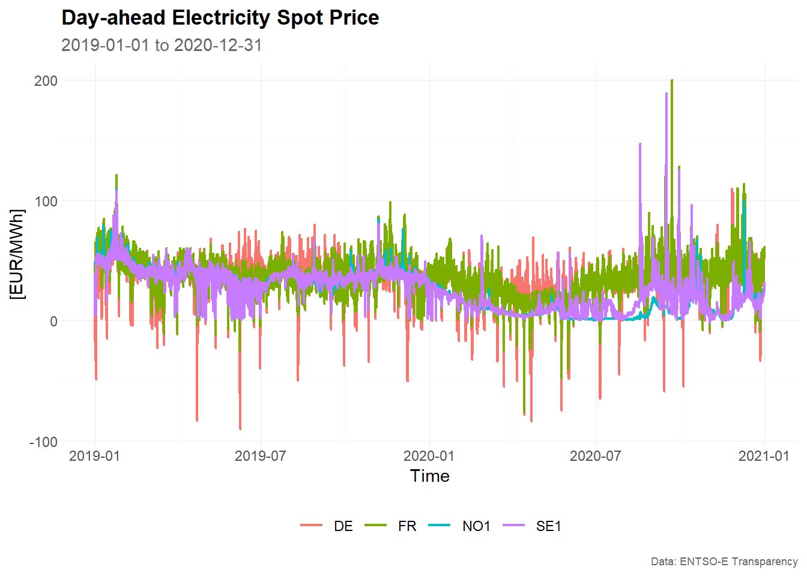
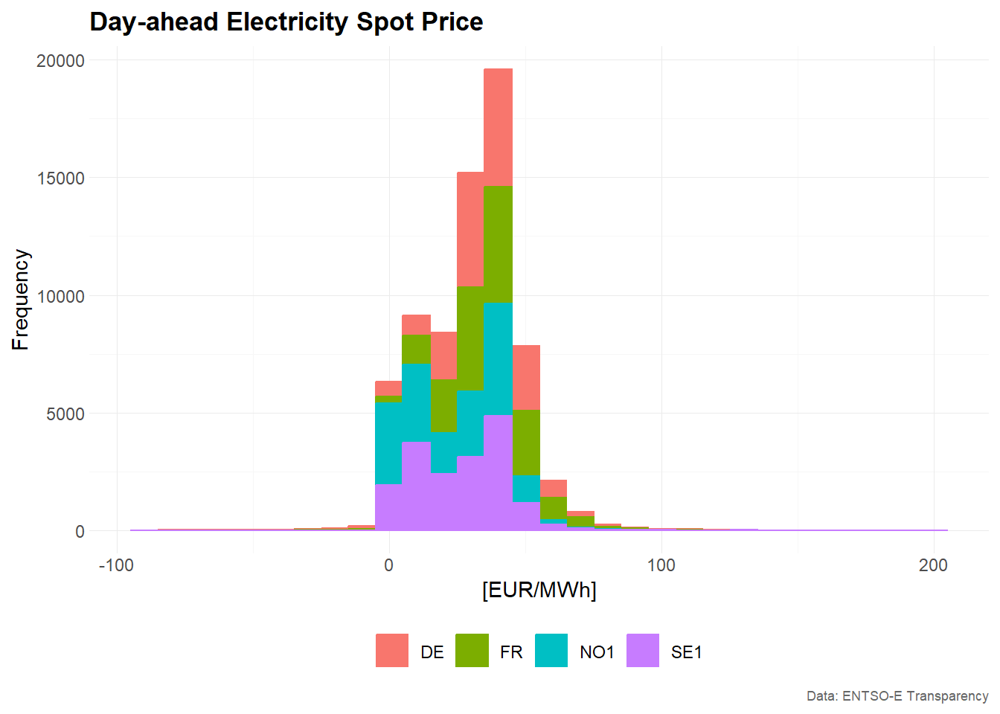
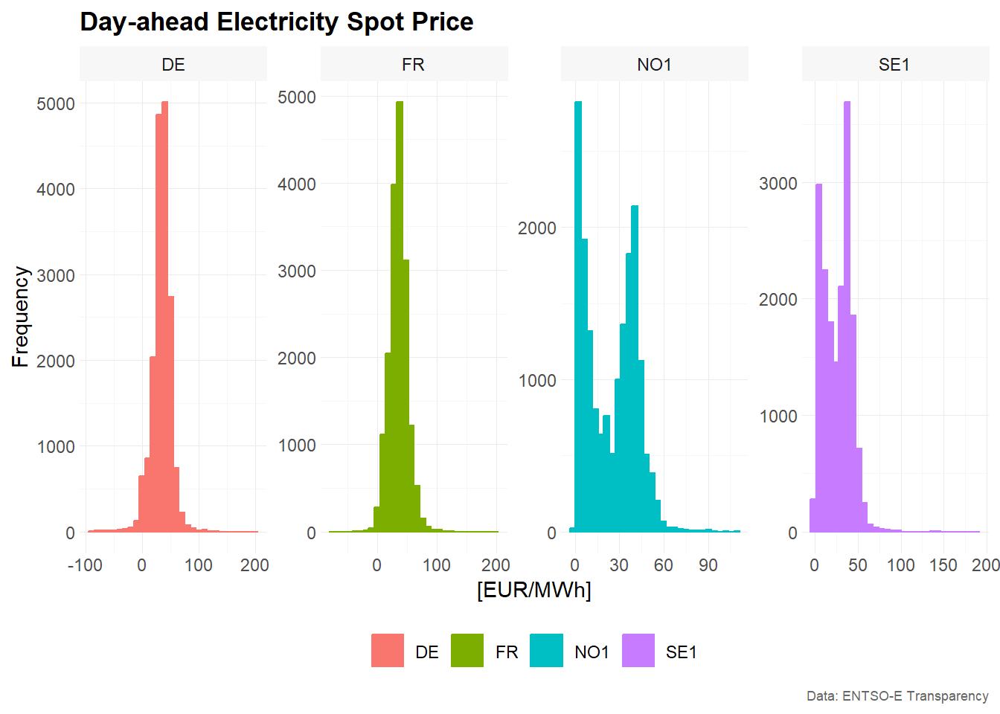
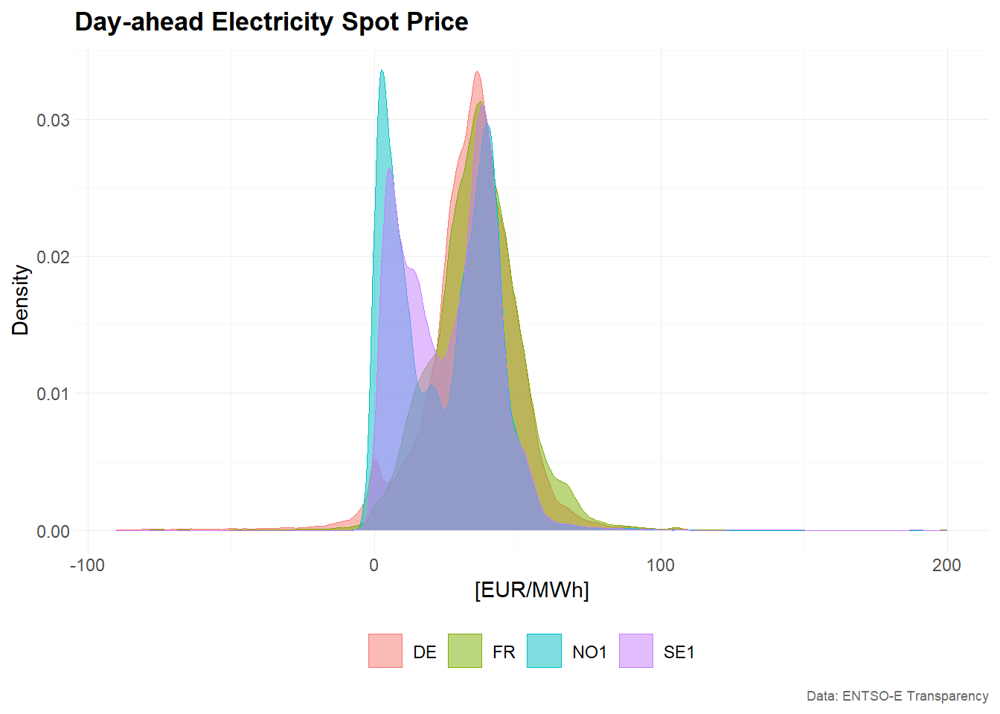
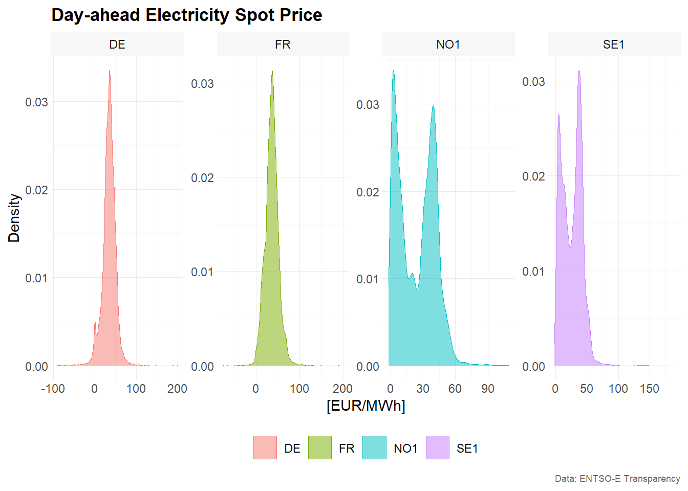
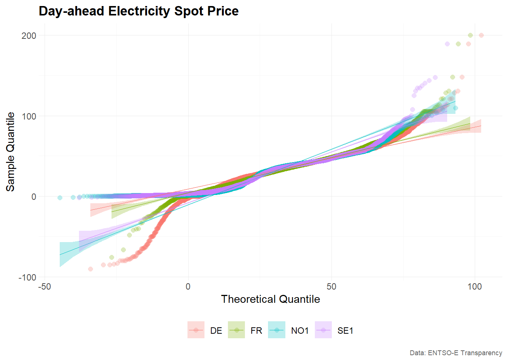
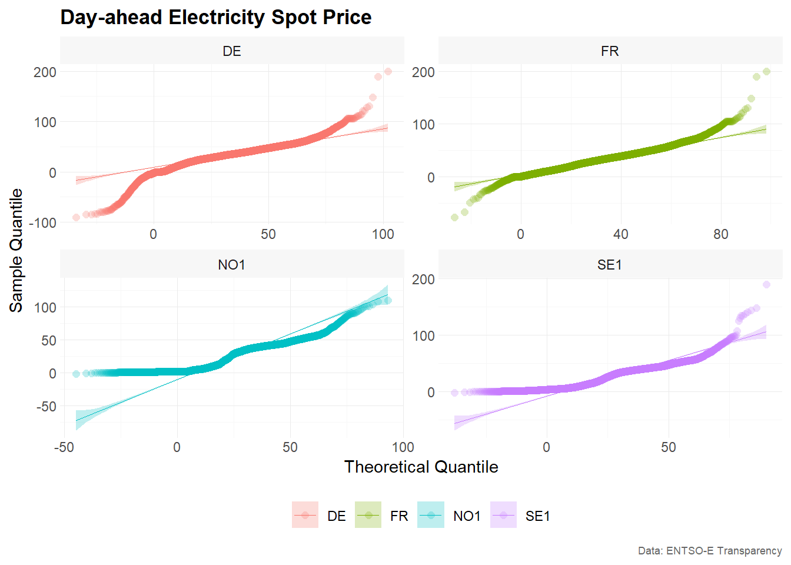

# Visualization of Time Series Data

You can install the development version from
[GitHub](https://github.com/) with:

``` r
# install.packages("devtools")
devtools::install_github("ahaeusser/tscv")
```

``` r
# Load relevant packages
library(tscv)
library(tidyverse)
library(tsibble)
```

## Data

``` r
series_id = "bidding_zone"
value_id = "value"
index_id = "time"

context <- list(
  series_id = series_id,
  value_id = value_id,
  index_id = index_id
)

# Prepare data set
main_frame <- elec_price %>%
  filter(bidding_zone %in% c("DE", "FR", "NO1", "SE1"))

main_frame
#> # A tibble: 70,176 × 5
#>    time                item            unit      bidding_zone  value
#>    <dttm>              <chr>           <chr>     <chr>         <dbl>
#>  1 2019-01-01 00:00:00 Day-ahead Price [EUR/MWh] DE            10.1 
#>  2 2019-01-01 01:00:00 Day-ahead Price [EUR/MWh] DE            -4.08
#>  3 2019-01-01 02:00:00 Day-ahead Price [EUR/MWh] DE            -9.91
#>  4 2019-01-01 03:00:00 Day-ahead Price [EUR/MWh] DE            -7.41
#>  5 2019-01-01 04:00:00 Day-ahead Price [EUR/MWh] DE           -12.6 
#>  6 2019-01-01 05:00:00 Day-ahead Price [EUR/MWh] DE           -17.2 
#>  7 2019-01-01 06:00:00 Day-ahead Price [EUR/MWh] DE           -15.1 
#>  8 2019-01-01 07:00:00 Day-ahead Price [EUR/MWh] DE            -4.93
#>  9 2019-01-01 08:00:00 Day-ahead Price [EUR/MWh] DE            -6.33
#> 10 2019-01-01 09:00:00 Day-ahead Price [EUR/MWh] DE            -4.93
#> # ℹ 70,166 more rows
```

## Line charts

``` r

# Example 1 -------------------------------------------------------------------

main_frame %>%
  plot_line(
    x = time,
    y = value,
    color = bidding_zone,
    facet_var = bidding_zone,
    title = "Day-ahead Electricity Spot Price",
    subtitle = "2019-01-01 to 2020-12-31",
    xlab = "Time",
    ylab = "[EUR/MWh]",
    caption = "Data: ENTSO-E Transparency"
    )
#> Warning: Using `size` aesthetic for lines was deprecated in ggplot2 3.4.0.
#> ℹ Please use `linewidth` instead.
#> ℹ The deprecated feature was likely used in the tscv package.
#>   Please report the issue at <https://github.com/ahaeusser/tscv/issues>.
#> This warning is displayed once per session.
#> Call `lifecycle::last_lifecycle_warnings()` to see where this warning was
#> generated.
#> Warning: The `size` argument of `element_line()` is deprecated as of ggplot2 3.4.0.
#> ℹ Please use the `linewidth` argument instead.
#> ℹ The deprecated feature was likely used in the tscv package.
#>   Please report the issue at <https://github.com/ahaeusser/tscv/issues>.
#> This warning is displayed once per session.
#> Call `lifecycle::last_lifecycle_warnings()` to see where this warning was
#> generated.
#> Warning: The `size` argument of `element_rect()` is deprecated as of ggplot2 3.4.0.
#> ℹ Please use the `linewidth` argument instead.
#> ℹ The deprecated feature was likely used in the tscv package.
#>   Please report the issue at <https://github.com/ahaeusser/tscv/issues>.
#> This warning is displayed once per session.
#> Call `lifecycle::last_lifecycle_warnings()` to see where this warning was
#> generated.
```



``` r

# Example 2 -------------------------------------------------------------------

main_frame %>%
  plot_line(
    x = time,
    y = value,
    color = bidding_zone,
    title = "Day-ahead Electricity Spot Price",
    subtitle = "2019-01-01 to 2020-12-31",
    xlab = "Time",
    ylab = "[EUR/MWh]",
    caption = "Data: ENTSO-E Transparency"
    )
```



## Bar charts

``` r
# # Estimate sample partial autocorrelation function
# corr_pacf <- estimate_pacf(
#   .data = main_frame,
#   context = context,
#   lag_max = 30
# )
# 
# corr_pacf
# 
# # Visualize PACF as correlogram
# corr_pacf %>%
#   plot_bar(
#     x = lag,
#     y = value,
#     color = sign,
#     facet_var = bidding_zone,
#     position = "dodge",
#     title = "Sample autocorrelation function",
#     xlab = "Lag",
#     ylab = "Correlation",
#     caption = "Data: ENTSO-E Transparency"
#   )
```

## Distributions

### Histograms

``` r
# Example 1 -------------------------------------------------------------------

main_frame %>%
  plot_histogram(
    x = value,
    color = bidding_zone,
    title = "Day-ahead Electricity Spot Price",
    xlab = "[EUR/MWh]",
    ylab = "Frequency",
    caption = "Data: ENTSO-E Transparency"
    )
#> Warning in geom_histogram(aes(x = {: Ignoring unknown parameters: `size`
#> `stat_bin()` using `bins = 30`. Pick better value `binwidth`.
```



``` r

# Example 2 -------------------------------------------------------------------

main_frame %>%
  plot_histogram(
    x = value,
    color = bidding_zone,
    facet_var = bidding_zone,
    facet_nrow = 1,
    title = "Day-ahead Electricity Spot Price",
    xlab = "[EUR/MWh]",
    ylab = "Frequency",
    caption = "Data: ENTSO-E Transparency"
    )
#> Warning in geom_histogram(aes(x = {: Ignoring unknown parameters: `size`
#> `stat_bin()` using `bins = 30`. Pick better value `binwidth`.
```



### Density

``` r
# Example 1 -------------------------------------------------------------------
main_frame %>%
  plot_density(
    x = value,
    color = bidding_zone,
    title = "Day-ahead Electricity Spot Price",
    xlab = "[EUR/MWh]",
    ylab = "Density",
    caption = "Data: ENTSO-E Transparency"
    )
```



``` r

# Example 2 -------------------------------------------------------------------
main_frame %>%
  plot_density(
    x = value,
    color = bidding_zone,
    facet_var = bidding_zone,
    facet_nrow = 1,
    title = "Day-ahead Electricity Spot Price",
    xlab = "[EUR/MWh]",
    ylab = "Density",
    caption = "Data: ENTSO-E Transparency"
    )
```



### QQ-Plot

``` r
# Example 1 -------------------------------------------------------------------
main_frame %>%
  plot_qq(
    x = value,
    color = bidding_zone,
    title = "Day-ahead Electricity Spot Price",
    xlab = "Theoretical Quantile",
    ylab = "Sample Quantile",
    caption = "Data: ENTSO-E Transparency"
    )
```



``` r

# Example 2 -------------------------------------------------------------------
main_frame %>%
  plot_qq(
    x = value,
    color = bidding_zone,
    facet_var = bidding_zone,
    title = "Day-ahead Electricity Spot Price",
    xlab = "Theoretical Quantile",
    ylab = "Sample Quantile",
    caption = "Data: ENTSO-E Transparency"
    )
```


