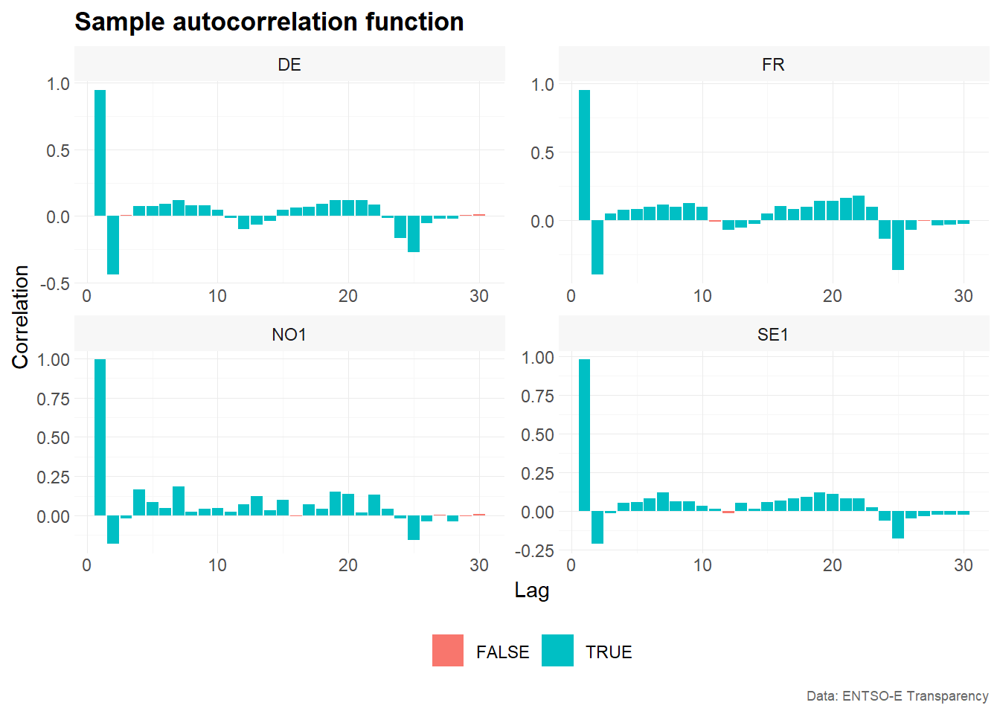

# Visualization of time series data

The package `tscv` provides a set of helper functions for time series
analysis, forecasting and time series cross-validation. In addition to
functions for splitting data and evaluating forecasts, the package
contains several visualization functions that are useful for exploratory
time series analysis.

This vignette demonstrates selected plotting functions from `tscv` using
hourly day-ahead electricity spot prices.

## Installation

You can install the development version from
[GitHub](https://github.com/) with:

``` r
# install.packages("devtools")
devtools::install_github("ahaeusser/tscv")
```

## Example

``` r
# Load relevant packages
library(tscv)
library(tidyverse)
library(tsibble)
```

## Data preparation

The data set `elec_price` is a `tibble` with day-ahead electricity spot
prices in \[EUR/MWh\] from the ENTSO-E Transparency Platform. The data
set contains hourly time series data from 2019-01-01 to 2020-12-31 for
eight European bidding zones.

In this vignette, we use four bidding zones:

- `DE`: Germany, including Luxembourg
- `FR`: France
- `NO1`: Norway 1, Oslo
- `SE1`: Sweden 1, Lulea

The visualization functions in `tscv` work with data in long format.
Therefore, we define a `context` object that identifies the relevant
columns:

- `series_id`: column identifying the individual time series
- `value_id`: column containing the numeric measurement variable
- `index_id`: column containing the time index

``` r
series_id = "bidding_zone"
value_id = "value"
index_id = "time"

context <- list(
  series_id = series_id,
  value_id = value_id,
  index_id = index_id
)

# Prepare data set
main_frame <- elec_price %>%
  filter(bidding_zone %in% c("DE", "FR", "NO1", "SE1"))

main_frame
#> # A tibble: 70,176 × 5
#>    time                item            unit      bidding_zone  value
#>    <dttm>              <chr>           <chr>     <chr>         <dbl>
#>  1 2019-01-01 00:00:00 Day-ahead Price [EUR/MWh] DE            10.1 
#>  2 2019-01-01 01:00:00 Day-ahead Price [EUR/MWh] DE            -4.08
#>  3 2019-01-01 02:00:00 Day-ahead Price [EUR/MWh] DE            -9.91
#>  4 2019-01-01 03:00:00 Day-ahead Price [EUR/MWh] DE            -7.41
#>  5 2019-01-01 04:00:00 Day-ahead Price [EUR/MWh] DE           -12.6 
#>  6 2019-01-01 05:00:00 Day-ahead Price [EUR/MWh] DE           -17.2 
#>  7 2019-01-01 06:00:00 Day-ahead Price [EUR/MWh] DE           -15.1 
#>  8 2019-01-01 07:00:00 Day-ahead Price [EUR/MWh] DE            -4.93
#>  9 2019-01-01 08:00:00 Day-ahead Price [EUR/MWh] DE            -6.33
#> 10 2019-01-01 09:00:00 Day-ahead Price [EUR/MWh] DE            -4.93
#> # ℹ 70,166 more rows
```

## Line charts

Line charts are the most common visualization for time series data. They
show how the observed values change over time and are useful for
detecting trends, seasonal patterns, level shifts, outliers and periods
of high volatility.

The function
[`plot_line()`](https://ahaeusser.github.io/tscv/reference/plot_line.md)
creates line charts from data in long format. The first example creates
a faceted plot, with one panel for each bidding zone.

``` r

# Example 1 -------------------------------------------------------------------

main_frame %>%
  plot_line(
    x = time,
    y = value,
    color = bidding_zone,
    facet_var = bidding_zone,
    title = "Day-ahead Electricity Spot Price",
    subtitle = "2019-01-01 to 2020-12-31",
    xlab = "Time",
    ylab = "[EUR/MWh]",
    caption = "Data: ENTSO-E Transparency"
    )
```


``` r

# Example 2 -------------------------------------------------------------------

main_frame %>%
  plot_line(
    x = time,
    y = value,
    color = bidding_zone,
    title = "Day-ahead Electricity Spot Price",
    subtitle = "2019-01-01 to 2020-12-31",
    xlab = "Time",
    ylab = "[EUR/MWh]",
    caption = "Data: ENTSO-E Transparency"
    )
```


The faceted version is useful when the individual time series have
different levels or volatility. The combined version is useful for
comparing the bidding zones directly in a single panel.

## Bar charts

Bar charts can be used to display summary values by category or lag. In
this example, we use
[`plot_bar()`](https://ahaeusser.github.io/tscv/reference/plot_bar.md)
to visualize the sample partial autocorrelation function.

The partial autocorrelation function measures the relationship between a
time series and its lagged values after controlling for the intermediate
lags. It is often used as an exploratory tool to identify relevant lag
structures in time series models.

First, we estimate the sample partial autocorrelation function using
[`estimate_pacf()`](https://ahaeusser.github.io/tscv/reference/estimate_pacf.md).
The argument `lag_max = 30` computes the partial autocorrelation for
lags 1 to 30.

``` r
# Estimate sample partial autocorrelation function
corr_pacf <- estimate_pacf(
  .data = main_frame,
  context = context,
  lag_max = 30
)

corr_pacf
#> # A tibble: 120 × 6
#>    bidding_zone type    lag    value  bound sign 
#>    <chr>        <chr> <int>    <dbl>  <dbl> <lgl>
#>  1 DE           PACF      1  0.948   0.0124 TRUE 
#>  2 DE           PACF      2 -0.437   0.0124 TRUE 
#>  3 DE           PACF      3  0.00539 0.0124 FALSE
#>  4 DE           PACF      4  0.0735  0.0124 TRUE 
#>  5 DE           PACF      5  0.0735  0.0124 TRUE 
#>  6 DE           PACF      6  0.0898  0.0124 TRUE 
#>  7 DE           PACF      7  0.119   0.0124 TRUE 
#>  8 DE           PACF      8  0.0786  0.0124 TRUE 
#>  9 DE           PACF      9  0.0820  0.0124 TRUE 
#> 10 DE           PACF     10  0.0469  0.0124 TRUE 
#> # ℹ 110 more rows

# Visualize PACF as correlogram
corr_pacf %>%
  plot_bar(
    x = lag,
    y = value,
    color = sign,
    facet_var = bidding_zone,
    position = "dodge",
    title = "Sample autocorrelation function",
    xlab = "Lag",
    ylab = "Correlation",
    caption = "Data: ENTSO-E Transparency"
  )
#> Warning in geom_bar(stat = "identity", position = position, aes(x = {:
#> Ignoring unknown parameters: `size`
```



The resulting correlogram shows the estimated partial autocorrelation by
lag and bidding zone. The variable `sign` indicates whether the absolute
value of the estimated partial autocorrelation exceeds the approximate
confidence bound used by
[`estimate_pacf()`](https://ahaeusser.github.io/tscv/reference/estimate_pacf.md).

## Distributions

Distribution plots are useful for understanding the marginal
distribution of the observed values. For electricity prices, this is
particularly relevant because prices may show skewness, heavy tails,
negative values or extreme spikes.

The following examples use histograms, density plots and QQ-plots to
explore the distribution of hourly electricity prices across bidding
zones.

### Histograms

Histograms show the frequency distribution of the observed values. They
are useful for identifying the range, central tendency, skewness and
outliers of a time series.

The first example overlays the distributions of the four bidding zones
in one plot.

``` r
# Example 1 -------------------------------------------------------------------

main_frame %>%
  plot_histogram(
    x = value,
    color = bidding_zone,
    title = "Day-ahead Electricity Spot Price",
    xlab = "[EUR/MWh]",
    ylab = "Frequency",
    caption = "Data: ENTSO-E Transparency"
    )
#> Warning in geom_histogram(aes(x = {: Ignoring unknown parameters: `size`
#> `stat_bin()` using `bins = 30`. Pick better value `binwidth`.
```


``` r

# Example 2 -------------------------------------------------------------------

main_frame %>%
  plot_histogram(
    x = value,
    color = bidding_zone,
    facet_var = bidding_zone,
    facet_nrow = 1,
    title = "Day-ahead Electricity Spot Price",
    xlab = "[EUR/MWh]",
    ylab = "Frequency",
    caption = "Data: ENTSO-E Transparency"
    )
#> Warning in geom_histogram(aes(x = {: Ignoring unknown parameters: `size`
#> `stat_bin()` using `bins = 30`. Pick better value `binwidth`.
```


The faceted histogram separates the bidding zones into individual
panels. This makes it easier to inspect the distribution of each time
series separately, especially when the distributions overlap in the
combined plot.

### Density

Density plots provide a smoothed version of the empirical distribution.
Compared with histograms, they are often easier to use when comparing
several distributions in one figure.

``` r
# Example 1 -------------------------------------------------------------------
main_frame %>%
  plot_density(
    x = value,
    color = bidding_zone,
    title = "Day-ahead Electricity Spot Price",
    xlab = "[EUR/MWh]",
    ylab = "Density",
    caption = "Data: ENTSO-E Transparency"
    )
#> Warning: Using `size` aesthetic for lines was deprecated in ggplot2 3.4.0.
#> ℹ Please use `linewidth` instead.
#> ℹ The deprecated feature was likely used in the tscv package.
#>   Please report the issue at <https://github.com/ahaeusser/tscv/issues>.
#> This warning is displayed once per session.
#> Call `lifecycle::last_lifecycle_warnings()` to see where this warning was
#> generated.
```


``` r

# Example 2 -------------------------------------------------------------------
main_frame %>%
  plot_density(
    x = value,
    color = bidding_zone,
    facet_var = bidding_zone,
    facet_nrow = 1,
    title = "Day-ahead Electricity Spot Price",
    xlab = "[EUR/MWh]",
    ylab = "Density",
    caption = "Data: ENTSO-E Transparency"
    )
```


The combined density plot highlights differences between bidding zones
in the location and spread of prices. The faceted version provides a
clearer view of each individual distribution.

### QQ-Plot

QQ-plots compare the empirical distribution of the observed values with
a theoretical distribution, usually the normal distribution. They are
useful for checking whether the data are approximately normally
distributed.

For electricity prices, deviations from normality are common because
prices can be skewed and may contain extreme values.

``` r
# Example 1 -------------------------------------------------------------------
main_frame %>%
  plot_qq(
    x = value,
    color = bidding_zone,
    title = "Day-ahead Electricity Spot Price",
    xlab = "Theoretical Quantile",
    ylab = "Sample Quantile",
    caption = "Data: ENTSO-E Transparency"
    )
```


``` r

# Example 2 -------------------------------------------------------------------
main_frame %>%
  plot_qq(
    x = value,
    color = bidding_zone,
    facet_var = bidding_zone,
    title = "Day-ahead Electricity Spot Price",
    xlab = "Theoretical Quantile",
    ylab = "Sample Quantile",
    caption = "Data: ENTSO-E Transparency"
    )
```


If the observations were approximately normally distributed, the points
in the QQ-plot would lie close to a straight line. Strong deviations
from this pattern indicate skewness, heavy tails or outliers.

## Summary

This vignette demonstrated several visualization functions from `tscv`:

- [`plot_line()`](https://ahaeusser.github.io/tscv/reference/plot_line.md)
  for time series line charts
- [`plot_bar()`](https://ahaeusser.github.io/tscv/reference/plot_bar.md)
  for bar charts, here used to visualize partial autocorrelations
- [`plot_histogram()`](https://ahaeusser.github.io/tscv/reference/plot_histogram.md)
  for histograms
- [`plot_density()`](https://ahaeusser.github.io/tscv/reference/plot_density.md)
  for density plots
- [`plot_qq()`](https://ahaeusser.github.io/tscv/reference/plot_qq.md)
  for QQ-plots

Together, these plots provide a useful starting point for exploratory
time series analysis. Line charts help inspect the temporal structure of
the data, while distribution plots and correlograms help identify
features that may be relevant for modelling and forecasting.
